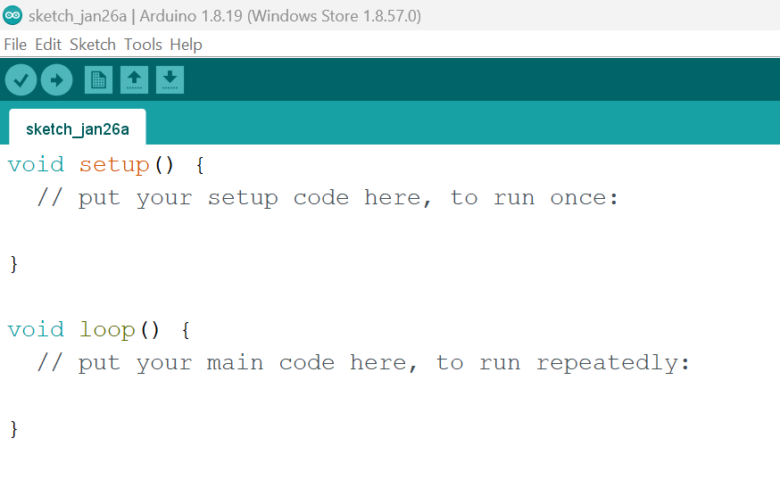

# Arduino

Arduino is an open-source prototyping platform based on easy-to-use hardware and software. In this lab, you will perform a few basic experiments using the Arduino. You will learn how to:

- Connect an Arduino to your laptop
- Create an electronic circuit using standard components
- Write code that runs on the Arduino and interacts with electronic components

## Arduino IDE

You will need to go [here](https://www.arduino.cc/en/software)  and download the correct Arduino IDE for your particular OS and install it.

Once installed, open the IDE - you should see an empty sketch similar to the following image: 

