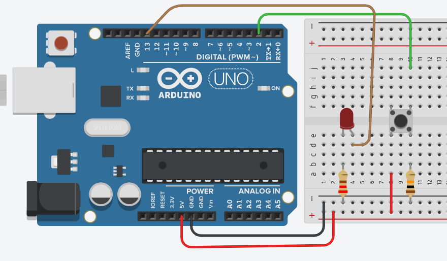

# Circuit 2

Wire up the experiment as shown in fig.1.
  

# Code
In the Arduino IDE, create a new sketch and enter the following code:

```c++
// constants won't change. They're used here to set pin numbers:
const int buttonPin = 2;  // the number of the pushbutton pin
const int ledPin = 13;    // the number of the LED pin

// variables will change:
int buttonState = 0;  // variable for reading the pushbutton status

void setup() {
  // initialize the LED pin as an output:
  pinMode(ledPin, OUTPUT);
  // initialize the pushbutton pin as an input:
  pinMode(buttonPin, INPUT);
}

void loop() {
  // read the state of the pushbutton value:
  buttonState = digitalRead(buttonPin);

  // check if the pushbutton is pressed. If it is, the buttonState is HIGH:
  if (buttonState == HIGH) {
    // turn LED on:
    digitalWrite(ledPin, HIGH);
  } else {
    // turn LED off:
    digitalWrite(ledPin, LOW);
  }
}

```

Compile and upload to the board as before. 

### Operation

When the pushbutton is open (unpressed) there is no connection between the two legs of the pushbutton, so the pin is connected to ground (through the pull-down resistor) and we read a LOW. When the button is closed (pressed), it makes a connection between its two legs, connecting the pin to 5 volts, so that we read a HIGH.

You can also wire this circuit the opposite way, with a pullup resistor keeping the input HIGH, and going LOW when the button is pressed. If so, the behaviour of the sketch will be reversed, with the LED normally on and turning off when you press the button.

If you disconnect the digital I/O pin from everything, the LED may blink erratically. This is because the input is "floating" - that is, it will randomly return either HIGH or LOW. **That's why you need a pull-up or pull-down resistor in the circuit.**
