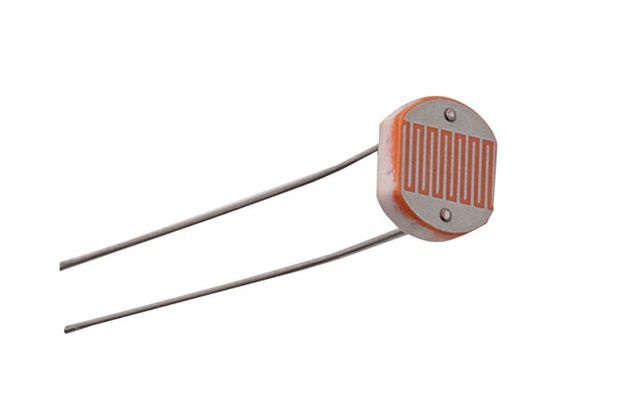

# Experiment 5 - Photoresistor Controlling a LED
This experiment uses a **photo resistor** to switch something on and off based on the light intensity. In this case, it will turn on an LED when it's dark(ish).

