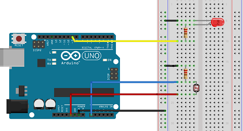

#Circuit

Wire up the experiment as shown in fig. 1



#The Code

In the Arduino IDE, create a new sketch and enter the following code:


```
//constants
const int pResistorPin = A0; // Photoresistor at Arduino analog pin A0
const int ledPin = 9;       // Led pin at Arduino pin 9
const int threshold = 25;  //You can change threshold value to change the sensitivity.

//Variables
int value;          // Store value from photoresistor (0-1023)

void setup(){
 pinMode(ledPin, OUTPUT);  // Set ledPin - 9 pin as an output
 pinMode(pResistorPin, INPUT);// Set pResistor - A0 pin as an input (optional)
}

void loop(){
  value = analogRead(pResistorPin);
  if (value > threshold){
    digitalWrite(ledPin, LOW); 
  }
  else{
    digitalWrite(ledPin, HIGH);
  }
}
```