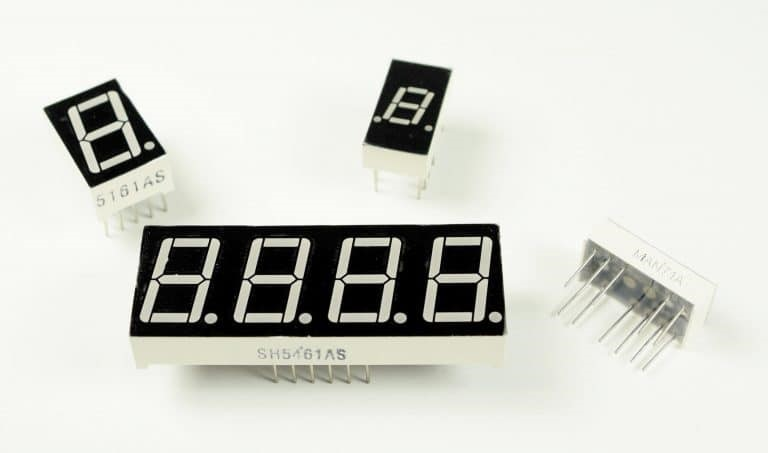
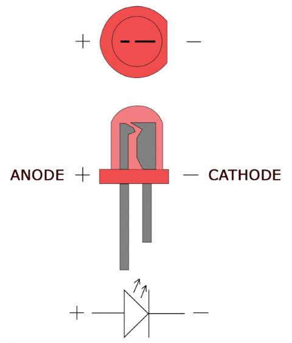
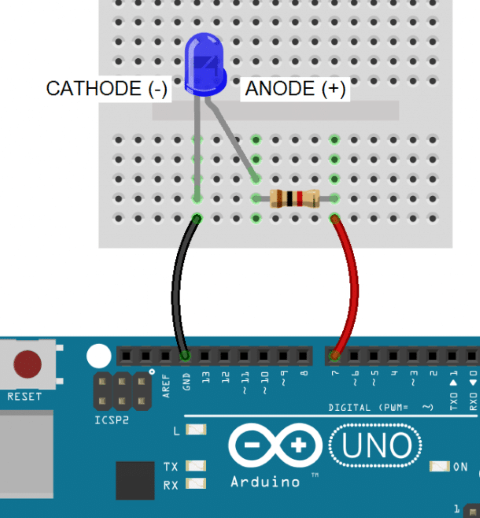
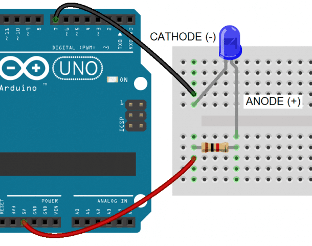
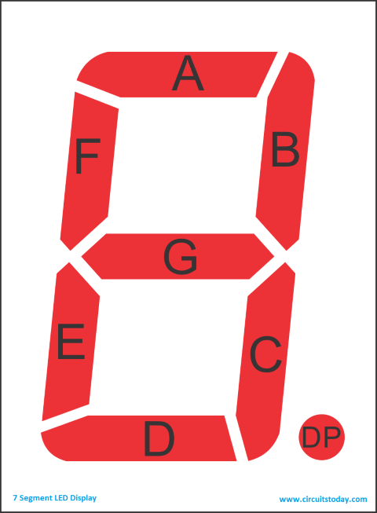
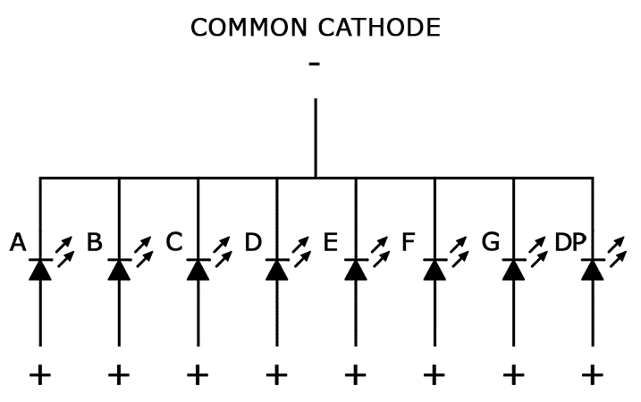
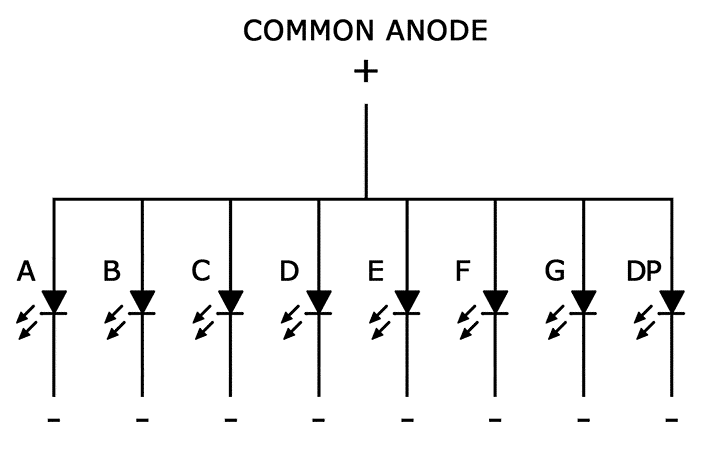

# Introduction

Seven segment displays are used in common household appliances like microwave ovens, washing machines, and air conditioners. They’re a simple and effective way to display numerical information like sensor readings, time, or quantities. In this lab, you will set up and program single digit seven segment displays on an Arduino.

# LEDs

In a previous lab we connected a LED to the Arduino. A single LED consists of two terminals, an anode and a cathode. The anode is the positive terminal and the cathode is the negative terminal:

There are two ways you can operate an LED from the Arduino, you already accomplished this by connecting the Anode (longer leg of the LED) to a Pin and pulling the Pin to High as  shown below:

~~~C
void setup(){
    pinMode(7, OUTPUT);
}

void loop(){ 
     digitalWrite(7, HIGH);
}
~~~

## Cathode to Pin

Alternatively, you ccan also connect the cathode to the PIN and turn on the LED by pulling the PIN to LOW.  

~~~C
void setup(){
    pinMode(7, OUTPUT);
}

void loop(){ 
     digitalWrite(7, LOW);
}
~~~

## 7 Segment Displays

Seven segment displays consist of 7 LEDs, called segments, arranged in the shape of an “8”. Most 7-segment displays actually have 8 segments, with a dot on the right side of the digit that serves as a decimal point. Each segment is named with a letter A to G, and DP for the decimal point. Each segment on the display can be controlled individually, just like a LED.

## Common Cathode and Common Anode

There are two types of 7-segment displays – common cathode and common anode.
 ### Common Cathode
In common cathode displays, all of the "segment" cathodes are connected to ground and individual segments are turned on and off by switching power to the anodes:

 ### Common Anode
In common anode displays, all of the anodes are connected to Vcc, and individual segments are turned on and off by switching power to the cathodes:  

**THIS IS THE 7 SEG TYPE YOU HAVE IN YOUR KITS**