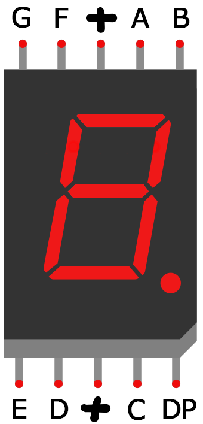
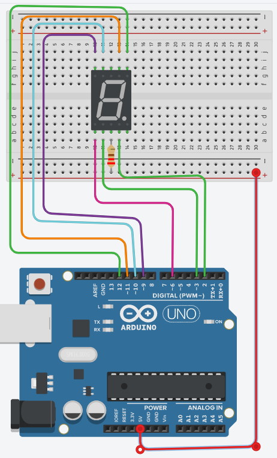

# Connecting 7-Seg Display

Single digit seven segment displays have 10 pins. Two pins connect to either ground (common cathode) or Vcc(common anode). The other 8 connect to each of the segments:

Before you can connect your display to the Arduino, you need to know if it’s common anode or common cathode, and which pins connect to each segment. This information should be in the datasheet. 

- Examine your 7 seg display and try to figure out which one it is( hint: use the serial/product numbers on it)

## Wire it up

Go to the following project on Tinkerca and use the diagram to wire up the 7 Seg display(use this diagram or click on it to open the Tinkercad project).

Examine the circuit. Notice that the segments are connected to the arduino as follows:

~~~
a -> 11;
b -> 12;
c -> 2;
d -> 3;
e -> 6;
f -> 10;
g -> 9;
~~~

+ Now, connect your arduino to your computer and open Arduino IDE.
+ Do **File -> New**.
+ Copy and Paste the following code into the Editor.
~~~c
const int a = 11;
const int b = 12;
const int c = 2;
const int d = 3;
const int e = 6;
const int f = 10;
const int g = 9;

//Set all segment pins for output
void setup()
{
  pinMode(a, OUTPUT);
  pinMode(b, OUTPUT);
  pinMode(c, OUTPUT);
  pinMode(d, OUTPUT);
  pinMode(e, OUTPUT);
  pinMode(f, OUTPUT);
  pinMode(g, OUTPUT);

}

//Function to display integer number on 7 seg display
void display(int i) {
  if (i == 1) {
    digitalWrite(a, HIGH);
    digitalWrite(b, LOW);
    digitalWrite(c, LOW);
    digitalWrite(d, HIGH);
    digitalWrite(e, HIGH);
    digitalWrite(f, HIGH);
    digitalWrite(g, HIGH);
  }
  if (i == 2) {
    digitalWrite(a, LOW);
    digitalWrite(b, LOW);
    digitalWrite(c, HIGH);
    digitalWrite(d, LOW);
    digitalWrite(e, LOW);
    digitalWrite(f, HIGH);
    digitalWrite(g, LOW);
  }
}

void loop()
{
  display(1);
  delay(1000);
  display(2);
  delay(1000);
}
~~~

Examine the ``display()`` function. Notice that we set segments b and c to **LOW** and all others to **HIGH**. This turns the b and c segments ON and turns all others off. 

+ Based on the code above, add more ``if`` statements to the ``display`` function for all other digits (0-9).
  
+ Update the loop() display all digits from 9 to 0. Why not use a ``for`` or ``while`` loop to do this. You can find out how [here](https://www.arduino.cc/reference/en/)

Once complete, save your code.