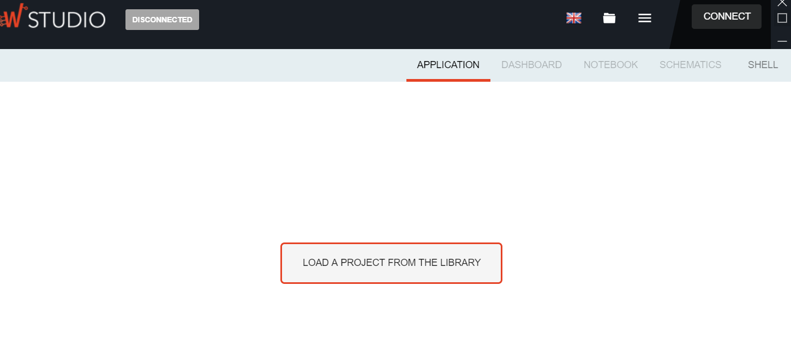
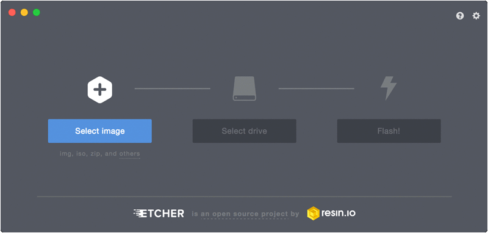

# Setup

Go to [Wyliodrin Website](https://wyliodrin.com/)  and download the application for your particular Operating System

Install the application and run it. It should look similar to the following.

# Setting up your Raspberry Pi

Setting up the board requires the following steps:

## RPi SD Card Image

You already have followed a similar process in your Computer Systems module when you installed Raspbian on the Raspberry Pi. You will need the ability to write the preconfigured Wyliodrin RPi image to your SD card.  There are several "image burners" available online. [Etcher](https://etcher.io/) is a straight-forward image burner writer that will work for Windows/Mac/Linux.  
Download and install [Etcher](https://etcher.io/) for your operating system and do the following:  

- Download the [preconfigured Raspberry Pi 3 Card Image](https://wyliodrinstudio.s3.eu-central-1.amazonaws.com/images/wyliodrin_studio_raspberrypi_2020_11_17.zip)

- Put your SD card into the reader on your computer. 
- Open Etcher and select the Wyliodrin Image file you wish to write to the SD card.
- Select the SD card you wish to write your image to.
- click 'Flash!' to begin writing data to the SD card.  

The write may take a few minutes. Once it's finished, close Etcher and leave the SD card in your computer for now. 

# Update SD Card with WIFI configuration
You will need to make some changes on the the SD card so that it will connect the RPi to your Wifi. 

The SD card is just like any other drive on your computer. You should be able to locate it using the default file explorer on your computer or navigate to it using a command line terminal. You will see at least one partition, possibly two depending on what OS is on your computer. What we are after at the moment is the **boot** partition which should be visible on all operating systems. It should be labelled as such in your file explorer if you are using a Mac or Linux machine. If you're using Windows, it will be the only accessible part of the SD card. 

**Note:** If you cannot see the boot partition, you may need to remove and replace the SD card in the reader.

## Create WIFI config file

**On Windows**, you need to save this file using Unix End of Line/Line Feed character (Unix(LF)).
If you have a good editor like VS Code on your machine you can set it at the bottom of the Editor as indicated in the image below. 

Otherwise, do the following: 

- Download and install Notepad++ from [here](https://notepad-plus-plus.org/download).
- Once installed, inside Notepad++ go to ``File > New`` to create a new file.
- In the top bar, select ``Edit > EOL Conversion``. Make sure ``Unix (LF)`` is selected. It should appear disabled if it is.
- Select ``File > Save as``, navigate to your ``boot`` drive and call the file ``wpa_supplicant.conf``.

## Enter Wifi Details
Enter the following into ``wpa_supplicant.conf``.

~~~bash
country=IE
ctrl_interface=DIR=/var/run/wpa_supplicant GROUP=netdev
update_config=1

network={
scan_ssid=1
ssid="Your-SSID"
psk="Your-PSK"
key_mgmt=WPA-PSK
}
~~~
Replace ``Your-SSID`` with your WiFi network, and ``Your-PSK`` with your WiFi password.
This file will tell the Raspberry Pi to connect to the specified network when it boots up.
The wifi network parameters here are typical for most domestic WiFi. If you're having problems connecting in the next section, examining how your computer connects to the WiFi. For example, ``key_mgmt`` could be either ``WPA-PSK`` (most probably) or ``WPA-EAP`` (enterprise networks).

When complete, your boot partition on the SDCard should contain the following:  

## Boot the Pi
- Eject the SD card and put it into the unplugged RPi. 
- Now power up the RPi - it should automatically connect to the the WiFi network. 