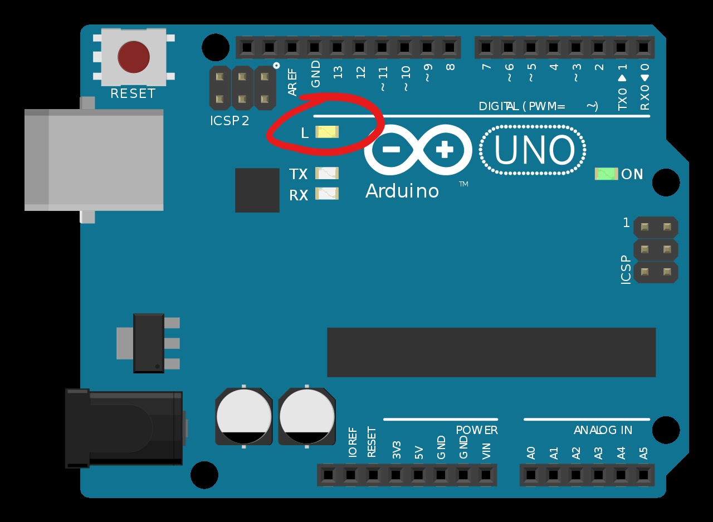

## The Code

First of all, lets check the Firmata protocol is working. Connect to the board and run the following code:

- Click on the *Projects* icon in the menu bar and then click *Create Application*  

You will now need to select the language you wish to use to code the RPi. 

- Name your project "Blinky", select *visual* for the programming language, and create the project.  

You should see the project appear in your list of projects. Click on it to open the project. You'll now see the Application coding window. This is a visual programming(like Scratch) 

+ Drag and drop the programming blocks from the left onto the Application tab.  

- Run the code by pressing the run button. You should see some LEDS flashing on the Arduino. Finally, the built in LED (attached to pin 13) should be left on.

- Now that you know the Firmata is working, replace the code with the following(you'll need to find the correct "blocks" to do this):  
  

- Run the code as before and you should see the red LED light up. Cover the light sensor and you should see the LED get brighter. Shine the light from your phone on the Light Sensor and you should see the LED get darker.

- open a console output Window by clicking on the console button at the bottom right corner of the Wyliodrin window. Notice the light values change when you put your finger over the light sensor (light dependent resistor)  

