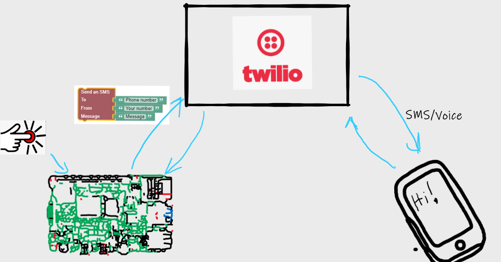

# Wyliodrin 2

The Connected Doorbell.

In this lab you will use Wyliodrin Studio to create a prototype smart doorbell. The idea here is that, when somebody presses the button, a text message and/or call is made to your phone. We will use [Twilio](www.twillio.com) to do this. 

In this lab you will:

+ Sign up for a Twilio account and get a phone number
+ Install the Twilio helper library
+ Send an outbound text message
+ Create a "Doorbell" circuit using a button/Arduino
+ Send a Text Message to your number when the button is pressed
+ Call your phone when the button is pressed

