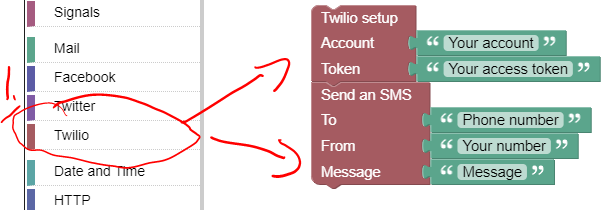

## Set up

### Sign up to Twilio

+ Go to [Twilio Signup](https://www.twilio.com/try-twilio) and follow the instructions. 
+ When asked to personalise your account, you can use enter the following:

+ On the Dashboard, get a "Trial Number" and accept the one issued to you. 

+ You want to be able to send SMS and make calls to your mobile. 

## Send a test SMS message from the RPi

To check that the Twilio service works, we will send a test message from a program created in Wyliodrin Studio

+ Connect to your RPi as before usong Wyliodrin Studio.
+ Create a new Visual Application called "Twilio Test"
+ Open the "Twilio  Test" application in Wyliodrin Studio
+ Locate the **Twilio** block group and add the following blocks to your program:  

+ Now, using the Twilio Dashboard, enter your account and phone number details. You can get the Account ID and Token from the Twilio Dashboard. The "From" phone number will be the **trial number** that Twilio issued you. The "To" number will be your mobile phone number. **Remember to use international codes in the numbers, (e.g +353 866042345)
+ Run the program, you should receive a SMS message on your phone sent from the RPi!  
 

