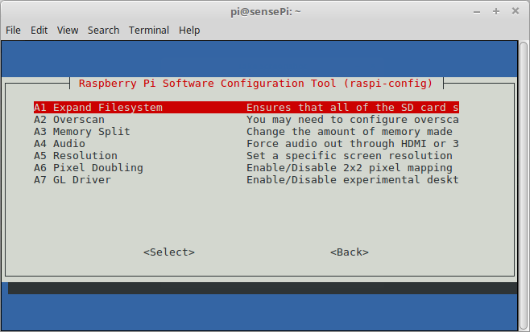

# Raspi-Config

You will now use the ``raspi-config`` utility to further configure the RPi.

+ Open Wyliodrin and connect to your Raspberry Pi

+ Select the **SHELL** tab to open a remote shell connection to the RPi

+ At the command prompt in the the RPi SSH session, enter ``sudo raspi-config``. This will show something similar to the following:   

   

### Change Password
It's probably not a good idea to let your RPi hang around on a network with the default username and password.
Select the ``Change User Password`` option and change the password now (and don't forget to remember it!)

### Expand rootfs
Typically, Raspberry Pi OS images are 2 GB. When you copy the image to a larger SD card then a large portion of the  card may be left unused. To make this available to Raspbian, and the apps installed on the RPi, you can expand it to  fill the rest of the SD card.  
In the Raspi-config tool, select Advanced Options->Expand Filesystem

  

You should be informed that the resize will take place on the next reboot of the RPi.

### Host Name
Your RPi will have the default host name of ``raspberrypi``. It would be good to rename this to something more meaningful. 
In the Raspi-config tool, select Network Options->Hostname
