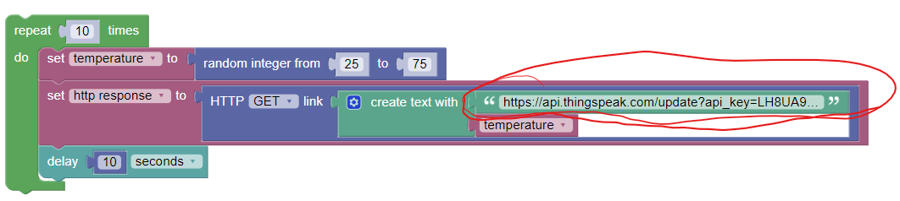
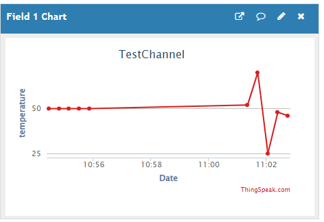

# Connect Raspberry Pi to Thingspeak

ThingSpeak enables clients to update and receive updates from channel feeds via **HTTP**. You can modify a previous lab, https://tutors-svelte.netlify.app/#/lab/project2-2022.netlify.app/topic04/book-1-wyliodrin-lab/The%20Code, using the Arduino/RPI to send real sensor data to the Thingspeak platform.

## Connect the RPi

+ Using Wyliodrin, connect to the the RPi and create a new  **Visual Project** called *Thingspeak*.
+ Add the following code blocks to the project

+ You will need to get the Write to Channel Feed URL ftom the Thingspeak platform(just like you did in the previous step). Use it to enter the URL where indicated above. It should be entered in the following format: "https://api.thingspeak.com/update?api_key=LH8UA9WSDFDSF29VR3&field1=". The code above concatenates the temperature variable to the URL before the request is made.

## Testing

This time, it's data from a real device. You should see random values appear in in the channel:

