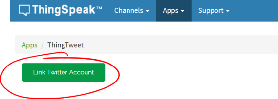
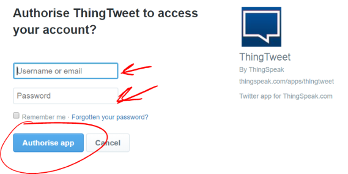
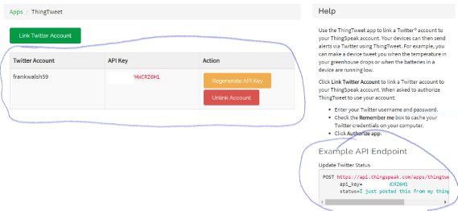

# Twitter API

For this step, you will need a Twitter account. You could use your personal account however, from previous experience, it's a great way to lose followers when they start seeing strange status updates about temperature and humidity!

Another approach is to create a separate Twitter account for your Status updates (e.g. a twitter account for your Smart Home!). 

**If you are averse to using Twitter, you could skip this step and use email as the notification option in the next step using IFTTT (see https://uk.mathworks.com/help/thingspeak/analyze-channel-data-to-send-email-notification-from-ifttt.html).**

+ From the menu, Select *Apps->ThingTweet*

+ Click on *Link Twitter Account*

+ Enter your Twitter account details as indicated and click *Authorise App*

You will be taken back to Thingspeak where the details of your new Thingtweet API:

Notice, like before, you have an example endpoint for the API on the right of the screen. Copy **the URL part** of the endpoint for the next section. 

## Test ThingTweet API

If you have not already, download and install *Postman* from [here](https://www.getpostman.com/)

To use the API to update your twitter status, Open postman and: 
 + Set the HTTP request type to POST
 + Copy and paste the URL into the URL field
 + Select the *Body* tab and enter the *api_key* and *status* values as shown below

 

 + Hit the send button and check your twitter status. 
 
 Remember, if you're using your personal twitter account, anybody following you will see what you post! 
 
 It's worth noting you now have an API that can be used to generate Tweets from any of your connected devices which can be programmed to generate HTTP requests.