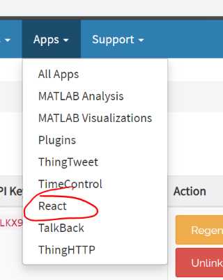
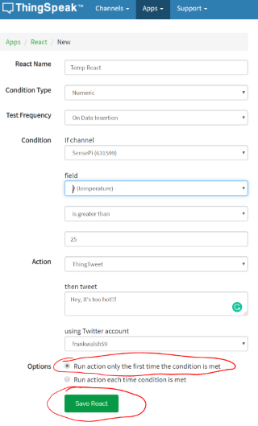

# Thingspeak React

Reacts allow you to trigger actions such as a HTTP request or send a tweet when your ThingSpeak Channel meets a certain condition. 

Example applications, from the Thingspeak web site:

*you can have your thermostat turn on by the time you get home from work by creating a Geo Location React. You could post a Twitter status when your power use is higher than normal by creating a Numeric React. You can create lots of different reactions to sensor data with the React, a ThingSpeak App.*

In this step, you will use the SensePi Channel to create a numeric React that tweets when a threshold temperature is exceeded.

+ In Thingspeak, select *Apps->React* from the menu.

 

 + Click on *New React* button and enter the following details, selecting your ThingTweet app where indicated.

  

  You can test the functionality by sending temperature data to the channel.

1. Using Postman or a Web browser, send a temperature value less than the threshold(e.g. **15**). Verify that no Twitter status update occurs.

2. Using Postman or a Web browser, send a temperature value greater than the threshold(e.g. **35**). Verify that a status update occurs and you get a Tweet!

3. Send another temperature value to the channel that exceeds the threshold. Verify that no Twitter status update is received.

You are now ready to connect the Raspberry Pi to Thingspeak.